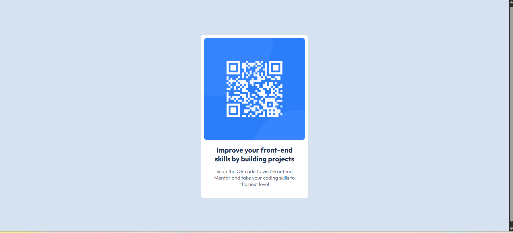

# Frontend Mentor - QR code component solution

## Overview

Created QR code component challenge on Frontend Mentor

### Screenshot

### Links

Github Link - https://github.com/Anas-n7/QR-Code-Static-site

## My process

### Built with

- Semantic HTML5 markup
- CSS custom properties
- Flexbox
- CSS Grid
- Mobile-first workflow